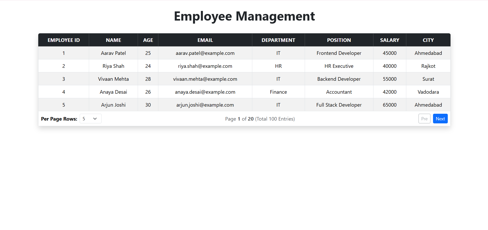
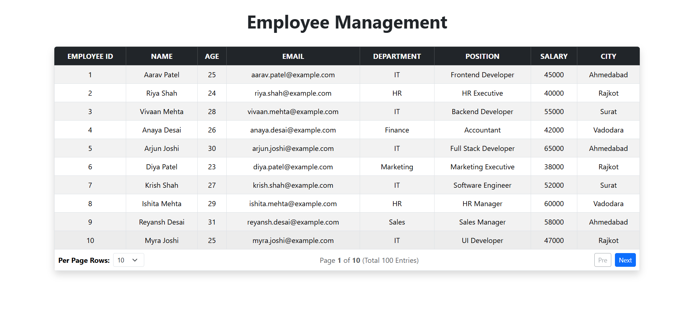
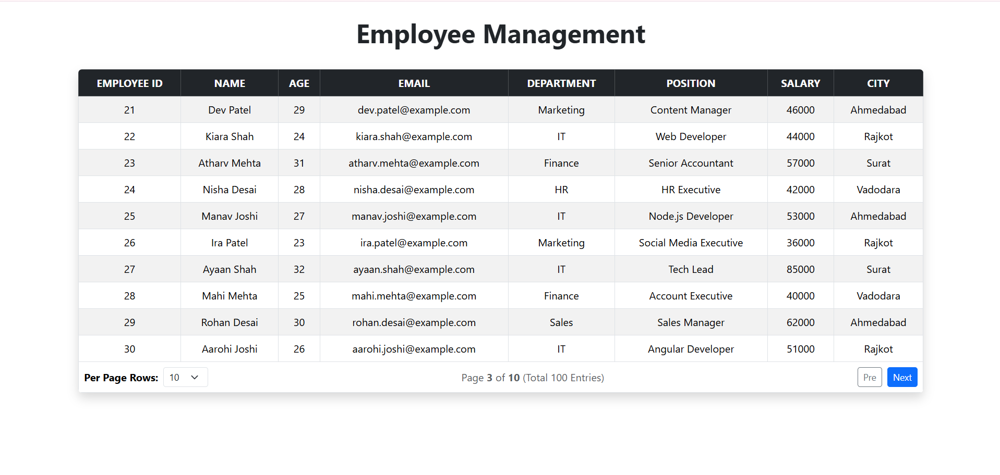
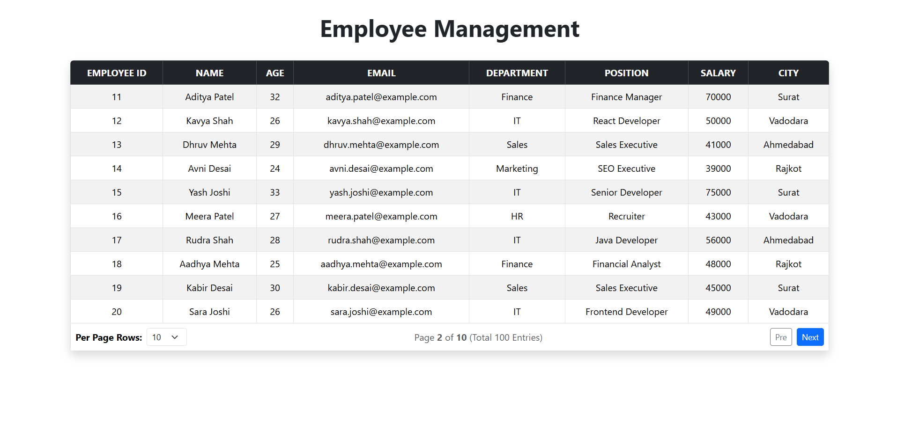

# 👨‍💼 Employee Management System

A simple **Employee Management System** built using **React.js, JavaScript ,Bootstrap, and JSON Server**.

This project fetches employee data from a JSON Server API and displays it in a responsive table with pagination.

## 🚀 Features

- Display employee data in a table
- Fetch data using `fetch()` API
- Responsive table using Bootstrap
- Pagination
- Select number of rows per page
- Previous and Next buttons
- Shows current page and total pages
- Shows total employee entries

## 🛠️ Technologies Used

- React.js
- JavaScript
- Bootstrap
- JSON Server
- HTML
- CSS

## 📂 Project Structure


- dataTable-project/
    - screenshots/
       - Screenshot1.png
       - Screenshot2.png
       - Screenshot3.png
       - Screenshot4.png

    - src/
       - App.jsx
       - main.jsx
       
    - db.json
    - README.md

## 📊 Employee Fields

- Id
- Name
- Age
- Email
- Department
- Salary
- City

## 📸 Screenshots

### 📄 5 Rows Per Page


### 📄 10 Rows Per Page


### 📄 Pagination - Next


### 📄 Pagination - Previous



## 📌 API

The project uses JSON Server as a backend.

```text
http://localhost:3000/Employees
```
## 🔗 Video Link
