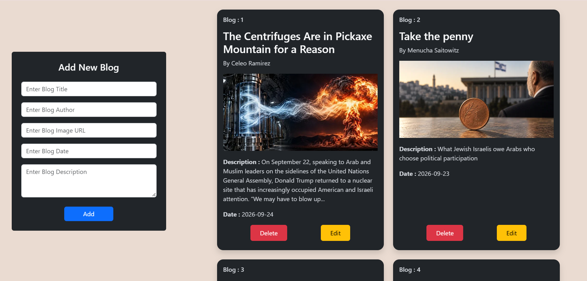
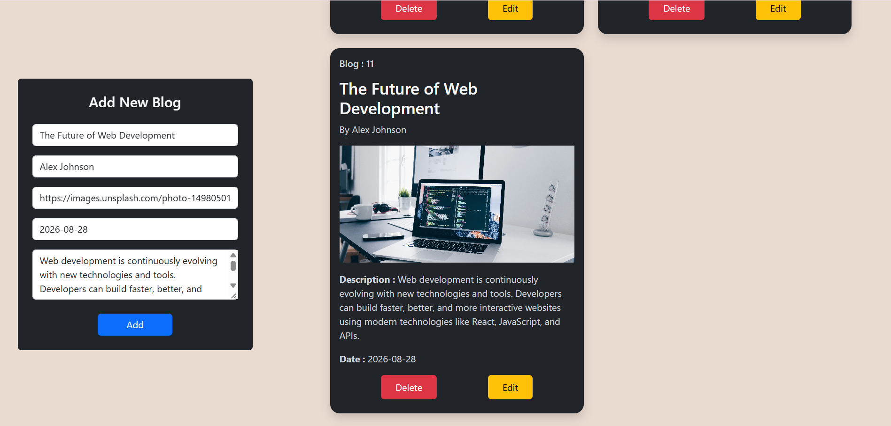
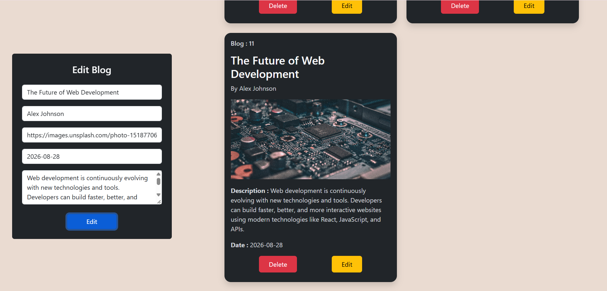
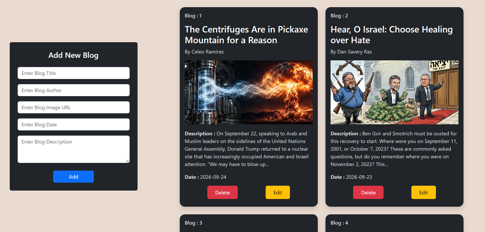

# ⚛️ React Blog Project

A simple Blog Management Application built using **React.js,Bootstrap,CSS and JSON Server**.

## ✨ Features

- Add new blog
- View all blogs
- Edit existing blog
- Delete blog
- Blog title, author, image, description and date
- Responsive card layout
- Two blog cards per row
- Form for adding and editing blogs

## 🛠️ Technologies Used

- React.js
- JavaScript
- HTML
- CSS
- Bootstrap
- JSON Server
- Vite

## 📁 Project Structure

- dbServer-Blog-Project/
  - screenshots/
    - Screenshot1.png
    - Screenshot2.png
    - Screenshot3.png
    - Screenshot4.png

  - src/
    - App.css
    - App.jsx
    - main.jsx  

  - README.md

## 📝 Blog Fields

- Title
- Author
- Image URL
- Description
- Date


## 📸 Screenshots

### 🏠 All Blogs


### ➕ Add Blog


### ✏️ Edit Blog


### 🗑️ Delete Blog


## 🔗 API

The project uses JSON Server as a backend.

```
http://localhost:3000/blog
```


## 🔗 Video Link

https://drive.google.com/file/d/1LnHoEMZrqHd8EjChj6XDVVb1j3TrV24S/view?usp=sharing