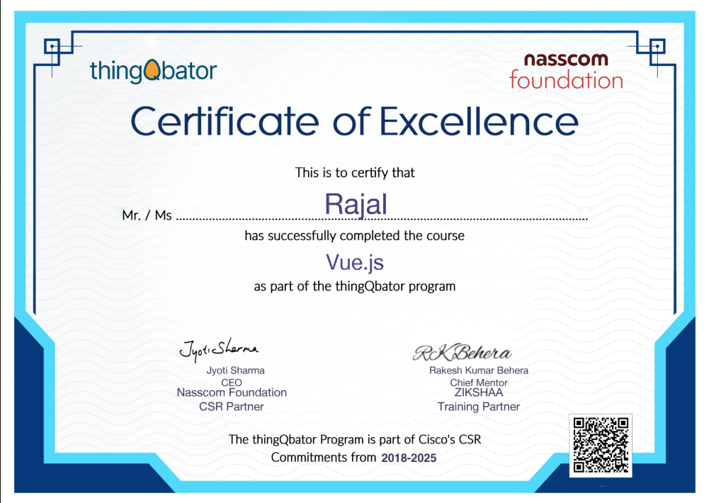
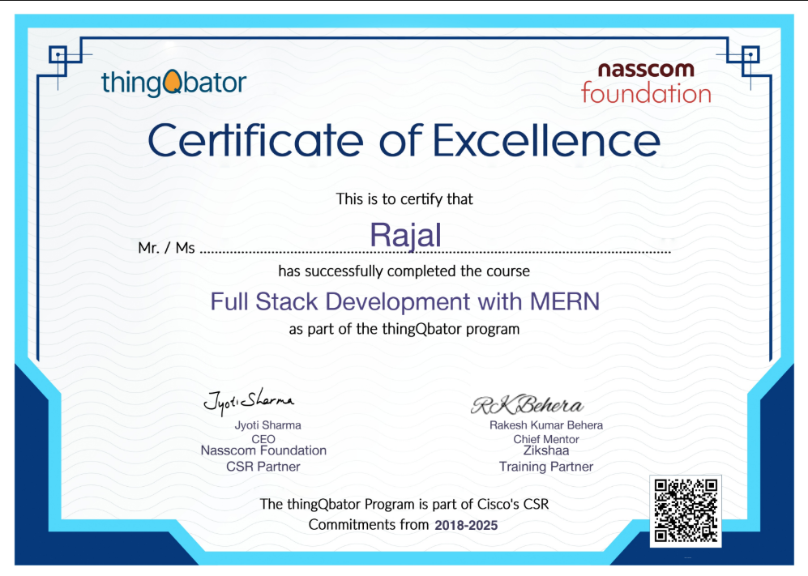
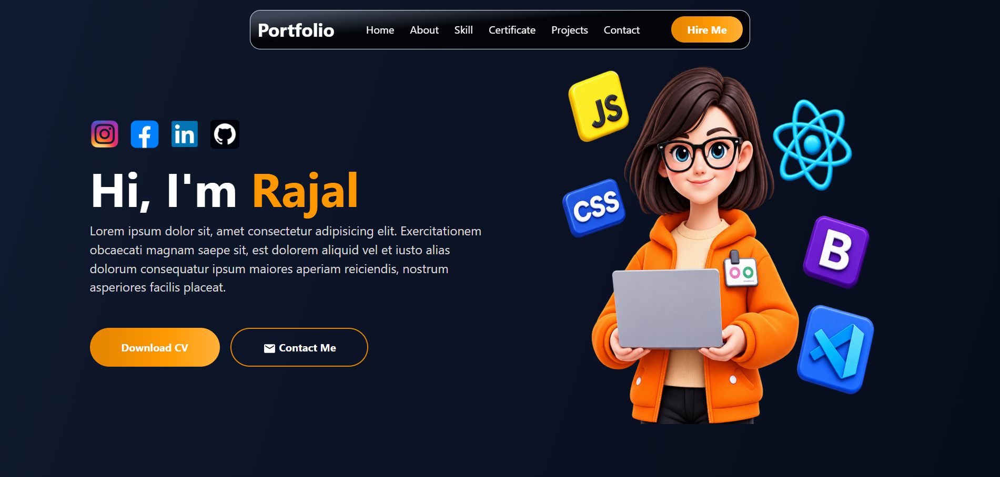
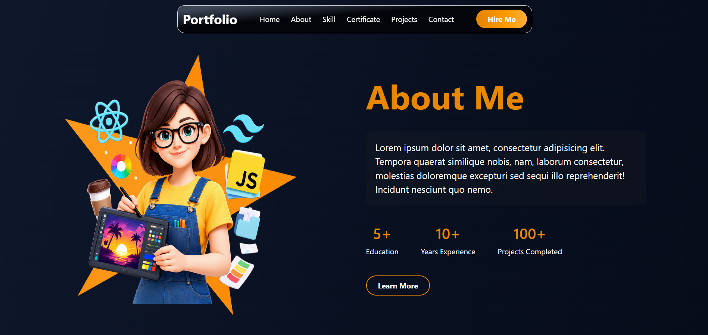
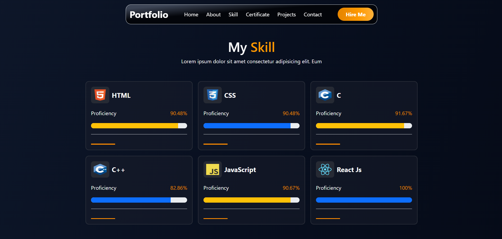
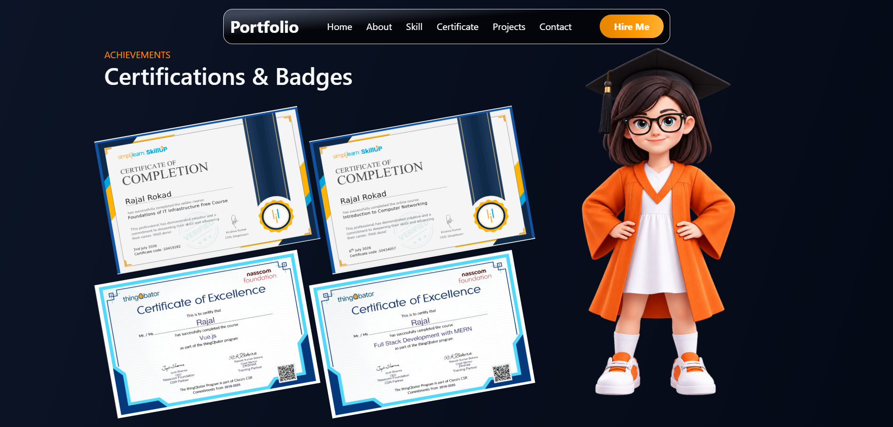
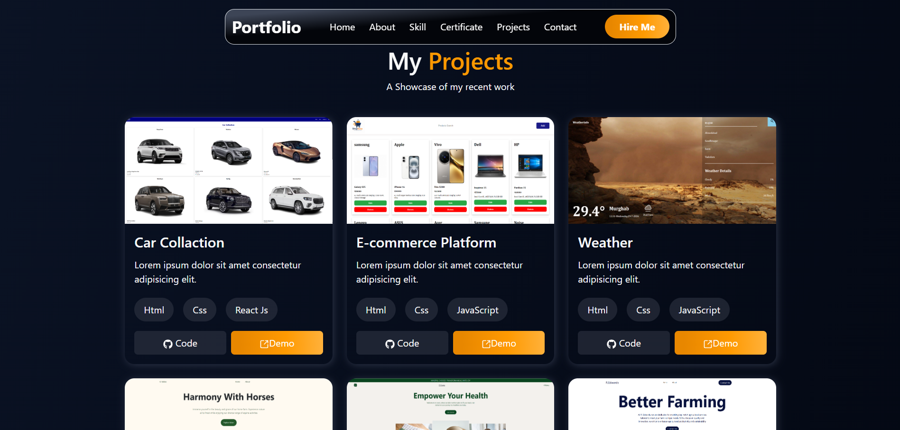
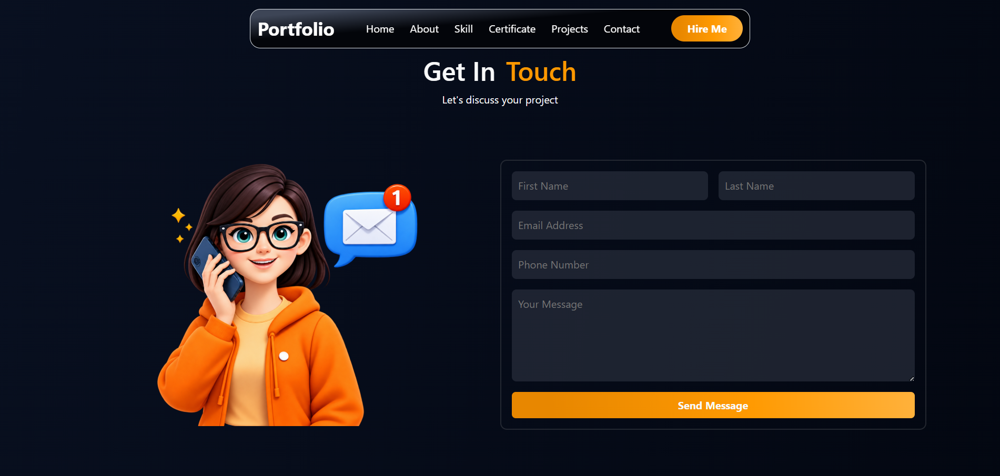

# 🌐 Personal Portfolio Website

A modern **Personal Portfolio Website** built using **React.js**, **JavaScript**, **JSX**, **Bootstrap**, **HTML**, and **CSS**.

This portfolio showcases my introduction, skills, certifications, projects, and contact information in a clean design.


## ✨ Features  

- Home section with personal introduction
- About Me section
- Skills section with proficiency  percentages
- Certifications & Badges section
- Projects showcase
- Contact form
- Social media icons
- Modern dark UI with orange highlights
- Smooth navigation between sections


## 🛠️ Technologies Used

- React.js
- JavaScript
- JSX
- HTML
- CSS
- Bootstrap


## 📚 Skills

| Skill      | Proficiency |
| ---------- | ----------: |
| HTML       |      90.48% |
| CSS        |      90.48% |
| C          |      91.67% |
| C++        |      82.86% |
| JavaScript |      90.67% |
| React JS   |        100% |


## 🚀 Projects

- 1. 🚗 **Car Collection**
  - Technologies Used : HTML , CSS , React. js 

- 2. 🛒 **E-commerce Platform**
  - Technologies Used : HTML , CSS , JavaScript 

- 3. 🌦️ **Weather Application**
  - Technologies Used : HTML , CSS , JavaScript 

- 4. 🐴 **Harmony With Horses**
  - Technologies Used : HTML , CSS , Bootstrap 

- 5. ❤️ **Empower Your Health**
  - Technologies Used : HTML , CSS ,Bootstrap 

- 6. 🌾 **Better Farming**
  - Technologies Used : HTML , CSS ,Bootstrap 


## 🏆 Certificates

### 🥇 Foundations of IT Infrastructure Free Course


### 🥇 Introduction to Computer Networking


### 🥇 Vue.js


### 🥇 Full Stack Development with MERN



## 📂 Project Structure

- src/
  - assets/
    - image1.png
    - image2.png
    - image3.png
    - image4.png
    - certificate1.png
    - certificate2.png
    - certificate3.png
    - certificate4.png
    - Project1.png
    - Project2.png
    - Project3.png
    - Project4.png
    - Project5.png
    - Project6.png
    - instagram.png
  - App.jsx
  - App.css
  - main.jsx
- README.md  


## 🔄 Project Flow

```
index.html
   ↓
main.jsx
   ↓
App.jsx
   ↓
   UI
```


## 📸 Screenshot

### 🏠 **Home**


### 👩‍💻 **About**


### 💻 **Skills**


### 🏆 **Certificates**


### 🚀 **Projects**


### 📩 **Contact**



## 🔗 Video Link

https://drive.google.com/file/d/1WrzHeXEN37WyVKShZ9cBfBTPXtmtXpjS/view?usp=sharing
