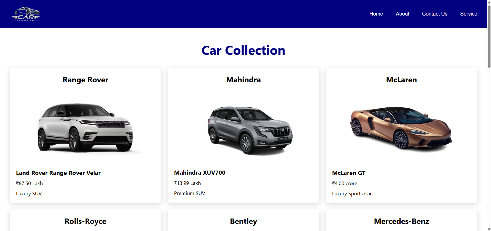

# 🚗 Car Collection

A simple and modern Car Collection website built using **React.js**.
This project displays different luxury, premium, sports, and performance cars with their company name, model, price, category, and image.


## 🚀 Features

- Display multiple cars
- Display car company name
- Display car model
- Display car price
- Display car category
- Display car images
- Inline CSS
- CSS-in-JS
- External CSS
- Reusable React components
- Car data passed using Props
- Cars displayed using .map() method

## 🎨 Styling

This project uses different CSS styling :

- Inline CSS
- CSS-in-JS
- External CSS


## 🛠️ Technologies Used

- React.js
- JavaScript
- JSX
- CSS
- Vite 

## 📂 Project Structure

- src/
  - assets/
    - car.png

  - components/
    - Footer.jsx
    - Header.jsx
    - Home.jsx

  - styles/
    - Home.css

  - all.css
  - App.jsx
  - main.jsx  

- README.md  

## 🔄 Project Flow

```
index.html
   ↓
main.jsx
   ↓
App.jsx
   ↓
components
   ↓
   UI
```

## 📸 Screenshot



## 🔗 Link

https://drive.google.com/file/d/14fbKWOFgyx_uZHWLNLE2zfqLb7vNesw0/view?usp=sharing
